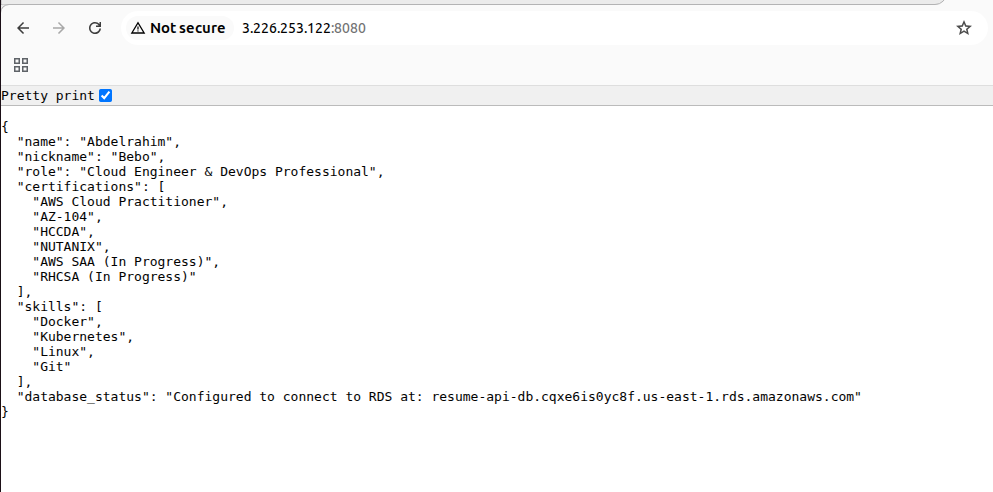

# 🚀 Scalable Resume API on AWS

A cloud-native Node.js application designed to demonstrate AWS Architecture best practices, including Containerization, VPC Networking, and RDS integration. This project is part of my journey towards the **AWS Solutions Architect Associate (SAA)** certification.

## 🏗 Architecture Overview
- **Compute:** Amazon EC2 (Dockerized Node.js App)
- **Registry:** Amazon ECR (Private Repository)
- **Database:** Amazon RDS (PostgreSQL/MySQL)
- **Networking:** Custom VPC with Public/Private Subnets
- **Security:** IAM Roles & Security Groups (Principle of Least Privilege)

## 🛠 Tech Stack
- **Language:** Node.js (Express.js)
- **DevOps:** Docker, Git, Amazon Linux 2023
- **Cloud:** AWS (ECR, EC2, IAM, VPC)

## 📈 Project Progress Log

## Phase 1: Dockerization & Cloud Registry (March 11, 2026)

In this initial phase, the focus was on preparing the application for the cloud by containerizing the Node.js environment and establishing a secure image management workflow.

### 💻 Application Development
RESTful API: Developed a Node.js Express application to serve professional resume data in JSON format.

Environment Configuration: Integrated environment variables (process.env) for database credentials, ensuring the code remains portable and secure across different environments.

### 🐳 Containerization (Docker)
Optimization: Authored a Dockerfile using the node:18-slim base image to minimize the attack surface and significantly reduce the final image size.

Build Workflow: Established a local build process on Ubuntu to package the application and its dependencies into a consistent, deployable unit.

### 📦 Cloud Registry & Identity (ECR & IAM)
IAM Configuration: Set up a dedicated IAM User with programmatic access to allow secure communication between the local Ubuntu terminal and AWS services.

Registry Management: Provisioned a Private Amazon ECR repository and successfully pushed the initial version of the API image (resume-api:latest).

## AWS Infrastructure Documentation: Resume API Network

## 🌐 Architecture Overview
This section outlines the foundational network infrastructure for the `aws-resume-api`. The architecture utilizes a Virtual Private Cloud (VPC) spanning two Availability Zones (`us-east-1a` and `us-east-1b`) for high availability. The network is strictly segmented into public and private tiers to isolate internal resources from direct external access.


## 🗄️ Subnet Topology
The network consists of 4 isolated subnets. Public subnets are designed for internet-facing resources (e.g., Load Balancers, Bastion Hosts), while private subnets are reserved for backend computing and databases.

| Subnet Name | Type | Availability Zone | IPv4 CIDR Block | IPv6 Support |
| :--- | :--- | :--- | :--- | :--- |
| `aws-resume-api-subnet-public1-us-east-1a` | Public | `us-east-1a` | `10.0.0.0/20` | None |
| `aws-resume-api-subnet-private1-us-east-1a` | Private | `us-east-1a` | `10.0.128.0/20` | None |
| `aws-resume-api-subnet-public2-us-east-1b` | Public | `us-east-1b` | `10.0.16.0/20` | None |
| `aws-resume-api-subnet-private2-us-east-1b` | Private | `us-east-1b` | `10.0.144.0/20` | None |

## 🚦 Gateways & Routing

### Internet Gateway
* **Name:** `aws-resume-api-igw`
* **Purpose:** Provides inbound and outbound internet connectivity exclusively for the public subnets.

## 🛡️ Security Groups

The following Security Groups are configured to manage inbound and outbound traffic for the EC2 instances and resources within the network.

| Security Group Name | Protocol | Port Range | Source/Destination | Purpose |
| :--- | :--- | :--- | :--- | :--- |
| **`resume-api-PassAll`** | All Traffic | All | `0.0.0.0/0` | **Testing Only:** Allows all inbound and outbound traffic. *(Note: Should be removed or restricted in production)* |
| **`resume-api-PassSSH`** | TCP (SSH) | `22` | `Your IP` / `0.0.0.0/0` | Allows secure shell access to the instances for administration. |
| **`resume-api-PassHTTP`** | TCP (HTTP) | `80` | `0.0.0.0/0` | Allows unencrypted web traffic to access the API or web servers. |

> **⚠️ Security Note:** It is highly recommended to restrict the source IP for `resume-api-PassSSH` to your specific IP address rather than allowing `0.0.0.0/0`, and to use `resume-api-PassAll` strictly for temporary debugging purposes.


## 🏗️ Phase 2 & 3: Infrastructure & Deployment (March 12, 2026)
In this phase, we transitioned from local containerization to a fully functional, secure, and scalable cloud architecture on AWS.

### Containerization to EC2 (Docker & ECR)
The application is containerized and pulled directly from Amazon Elastic Container Registry (ECR).

### 1. Environment Setup
Docker is installed and configured to run automatically on the EC2 instance:
```bash
sudo yum update -y
sudo yum install docker -y
sudo systemctl start docker
sudo systemctl enable docker
```
### 2. ECR Authentication
Authenticated the Docker CLI with the AWS ECR registry:

```Bash
aws ecr get-login-password --region us-east-1 | docker login --username AWS --password-stdin 422015754060.dkr.ecr.us-east-1.amazonaws.com
```
### 3. Image Deployment
Pulled the latest application image from the registry:

```Bash
docker pull 422015754060.dkr.ecr.us-east-1.amazonaws.com/resume-api:latest

docker images
REPOSITORY                                                TAG       IMAGE ID       CREATED        SIZE
422015754060.dkr.ecr.us-east-1.amazonaws.com/resume-api   latest    7cc3bf39340d   24 hours ago   197MB
```


### 🛡️ Security & Identity (IAM)
Principle of Least Privilege: Created a custom IAM Instance Profile (EC2-ECR-Pull-Role) for the EC2 instance.

Access Control: Attached AmazonEC2ContainerRegistryReadOnly and AmazonSSMManagedInstanceCore policies to allow the instance to pull images securely without hardcoded credentials.

### 🌐 Networking & Databases (VPC & RDS)
Database Isolation: Provisioned an Amazon RDS (MySQL) instance within Private Subnets to ensure it is not accessible from the public internet.

DB Subnet Groups: Configured a custom Subnet Group spanning multiple Availability Zones (us-east-1a, us-east-1b) for High Availability.

Security Group Chaining: Implemented an SG-to-SG inbound rule. The RDS Security Group only allows traffic on port 3306 from the specific Security Group ID of the EC2 instance, rather than a static IP.

### 💻 Compute & Orchestration (EC2 & Docker)
Instance Environment: Launched an Amazon Linux 2023 EC2 instance in a Public Subnet.

Remote Management: Utilized EC2 Instance Connect for secure terminal access.

Container Deployment:

Installed and configured Docker on the Amazon Linux environment.

Authenticated with Amazon ECR to pull the resume-api:latest image.

Deployed the container using environment variables to securely link the application with the RDS endpoint.

### 🚀 Final Result
The API is now live and successfully communicating with the RDS backend.

Endpoint: http://3.226.253.122:8080/api/resume
Status: Connection verified and data is being served as JSON.



# 🗄️ S3 Storage & CORS Configuration

## 📖 Overview
This section documents the configuration of the Amazon S3 bucket used for securely storing and managing application files (e.g., resumes). The bucket is configured with strict access controls to ensure data privacy and security.

## 🪣 Bucket Details
| Property | Configuration |
| :--- | :--- |
| **Bucket Name** | `resume-api-bucket-1` |
| **AWS Region** | `us-east-1` (N. Virginia) |

## 🔒 Security & Access Management
The bucket is secured using AWS best practices to prevent unintended public exposure:

* **Block Public Access:** `ON` 
  * All public access (via ACLs, bucket policies, or access points) is completely blocked.
* **Object Ownership:** `Bucket owner enforced` 
  * Access Control Lists (ACLs) are disabled. All objects in this bucket are owned strictly by the AWS account. Access is managed exclusively through policies.
## 🔄 Bucket Versioning
* **Status:** `Enabled`
* **Purpose:** Bucket versioning is enabled to keep multiple variants of an object in the same bucket. This acts as a backup mechanism, protecting the stored resumes against accidental overwrites or deletions, and allowing for easy recovery of previous versions.

## 🌐 Cross-Origin Resource Sharing (CORS)
To allow the client web application to securely interact with the S3 bucket (for uploading and downloading files), the following CORS policy has been applied:

```json
[
    {
        "AllowedHeaders": [
            "*"
        ],
        "AllowedMethods": [
            "GET",
            "PUT",
            "POST",
            "DELETE"
        ],
        "AllowedOrigins": [
            "*"
        ],
        "ExposeHeaders": []
    }
]
```
# 📂 Shared File Storage (Amazon EFS)

## 📖 Overview
This section documents the configuration of the Amazon Elastic File System (EFS). The EFS is provisioned to provide a centralized, highly available, and scalable shared storage solution across multiple EC2 instances within our architecture.

## ⚙️ File System Configuration
| Property | Configuration |
| :--- | :--- |
| **File System ID** | `[fs-0a249541bd8846a9b]` |
| **File System Type** | Regional (Multi-AZ for high availability) |
| **Performance Mode** | General Purpose / Bursting |
| **Throughput Mode** | Elastic |
| **Encryption** | Enabled (Data at rest) |

## 🌐 Network Access & Mount Targets
The EFS is securely attached to our custom VPC. Mount targets have been created in the specified subnets to allow EC2 instances to connect via the NFS protocol.

* **Security Group:** `[EFS-Server]` (Must allow inbound NFS traffic on Port 2049 from the EC2 instances).

## 🛠️ Mounting Instructions
To attach the EFS to an EC2 instance, the necessary NFS utilities must be installed, and the security group must be properly configured to prevent connection timeouts.

**1. Install EFS Utilities (Amazon Linux):**
```bash
sudo yum install -y amazon-efs-utils
```
**2. Create the Mount Directory:**
```Bash
sudo mkdir -p /mnt/efs
```
**3. Mount the File System:**
(Ensure the EC2 Security Group is allowed in the EFS Inbound Rules to prevent a 15-second timeout error).
```Bash
sudo mount -t efs -o tls [fs-0a249541bd8846a9b]:/ /mnt/efs
```
**4. Verify the Mount:**
```Bash
df -h
```


# 📈 Auto Scaling & High Availability (ASG)

## 📖 Overview
To ensure the application remains highly available while strictly managing cloud costs (operating within the AWS Free Tier constraints), an Amazon EC2 Auto Scaling Group (ASG) has been implemented. The ASG dynamically adjusts the number of compute instances based on real-time CPU utilization, ensuring we only pay for the compute power we actually need.

## ⚙️ Launch Template Configuration
The Auto Scaling Group relies on a pre-configured Launch Template that acts as the blueprint for all newly scaled instances.
* **Source Image:** Custom AMI (`ami-03500eeac27f0f059`) created from the configured base EC2 instance.
* **Instance Type:** `t3.micro` .
* **Security & Networking:** Deployed within the custom VPC and attached to the existing application Security Group.

## ⚖️ Auto Scaling Group Settings

### 1. Group Size & Capacity Limits
Configured with a highly conservative approach to prevent runaway costs while ensuring baseline availability.
| Property | Value | Purpose |
| :--- | :--- | :--- |
| **Desired Capacity** | `1` | Starts the environment with a single active instance. |
| **Minimum Capacity** | `1` | Ensures the application never goes offline; replaces the instance if it fails. |
| **Maximum Capacity** | `3` | Caps the maximum number of instances at 2 to strictly control costs during traffic spikes. |

### 2. Network 
* **Subnets:** Distributed across `[us-east-1a]` and `[us-east-1b]` for fault tolerance.

### 3. Automatic Scaling Policy
The ASG uses a **Target Tracking Scaling Policy** to trigger scale-out and scale-in events based on compute stress.
* **Metric Type:** `Average CPU utilization`
* **Target Value:** `70%` (If the primary instance sustains >70% CPU usage, the second instance is launched automatically).
* **Instance Warmup:** `300 seconds` (Gives the new instance 5 minutes to boot up before CloudWatch starts tracking its metrics).

### 4. Health Checks & Protection
* **Health Check Type:** `EC2` (Monitors instance status checks).
* **Grace Period:** `300 seconds`.
* **Scale-in Protection:** `Disabled` (Crucial for cost-saving; allows AWS to automatically terminate the extra instance once the CPU load drops below the target value).
* **Termination Policy:** Default behavior (Terminates the oldest instance or the one closest to the next billing hour when scaling in).


Markdown
# 🚀 Resume API - Deployment & Infrastructure Guide

This repository contains the deployment workflow, containerization details, and troubleshooting documentation for the Resume API project hosted on AWS.

---

## 📦 Containerization & CI/CD Workflow
The deployment follows a professional Docker-to-ECR pipeline to ensure consistency across environments.

| Step | Action | Command |
| :--- | :--- | :--- |
| **1** | **Local Build** | `docker build -t resume-api .` |
| **2** | **ECR Tagging** | `docker tag resume-api:latest 422015754060.dkr.ecr.us-east-1.amazonaws.com/resume-api:latest` |
| **3** | **Cloud Push** | `docker push 422015754060.dkr.ecr.us-east-1.amazonaws.com/resume-api:latest` |

---

## 🚀 Production Deployment Command (EC2)
To run the container on the EC2 instance, environment variables are injected at runtime to connect the API with the S3 storage layer:

```bash
docker run -d -p 8080:8080 \
  -e S3_BUCKET_NAME=resume-api-bucket-1 \
  -e AWS_REGION=us-east-1 \
  [422015754060.dkr.ecr.us-east-1.amazonaws.com/resume-api:latest](https://422015754060.dkr.ecr.us-east-1.amazonaws.com/resume-api:latest)
```
## 🛡️ IAM Troubleshooting & Resolution
During the initial deployment of the updated container, a 403 AccessDenied error was captured in the Docker logs during the S3 upload process.

Root Cause:
The EC2 instance was associated with a restrictive role: EC2-ECR-Pull-Role.
This role lacked the s3:PutObject permission required to write files to the bucket.
Resolution:

Collaborated with the Cloud Architect to modify the IAM Role.

Attached the AmazonS3FullAccess policy to the instance role, enabling secure, credential-less communication between the EC2 and S3 services.

🧪 Verification & Final Testing
The integration was verified by executing a multipart POST request from the EC2 terminal to ensure the end-to-end flow (API -> S3) is functional.

Test Command:

```Bash
curl -X POST http://localhost:8080/upload-cv -F "cv=@test-cv.txt"
```
Expected Output:

`Status: 200 OK`

Response Body:

```JSON
{
  "message": "File uploaded successfully! ✅",
  "fileName": "resumes/1773411156110-test-cv.txt"
}
```


هل هناك أي أجزاء أخرى أو صور إضافية تود تحويلها وإضافتها لهذا الملف؟
