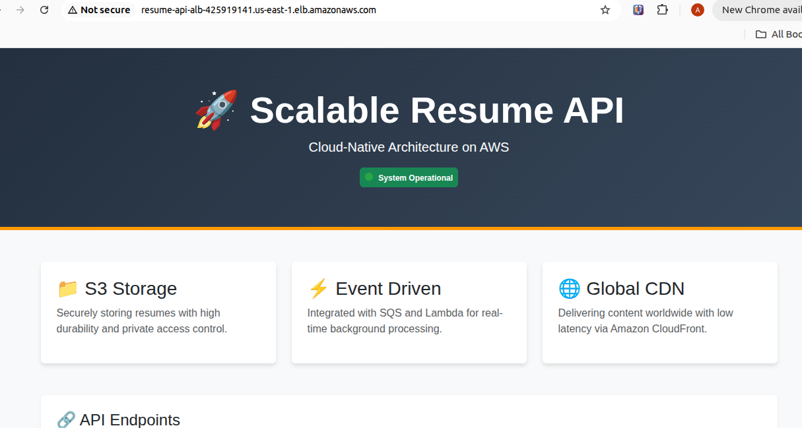

# 🚀 Scalable Resume API on AWS

A cloud-native Node.js application designed to demonstrate AWS Architecture best practices, including Containerization, VPC Networking, and RDS integration. This project is part of my journey towards the **AWS Solutions Architect Associate (SAA)** certification.

## 🏗 Architecture Overview
- **Compute:** Amazon EC2 (Dockerized Node.js App)
- **Registry:** Amazon ECR (Private Repository)
- **Database:** Amazon RDS (PostgreSQL/MySQL)
- **Networking:** Custom VPC with Public/Private Subnets
- **Security:** IAM Roles & Security Groups (Principle of Least Privilege)

## 🛠 Tech Stack
- **Language:** Node.js (Express.js)
- **DevOps:** Docker, Git, Amazon Linux 2023
- **Cloud:** AWS (ECR, EC2, IAM, VPC)

## 📈 Project Progress Log

## Phase 1: Dockerization & Cloud Registry (March 11, 2026)

In this initial phase, the focus was on preparing the application for the cloud by containerizing the Node.js environment and establishing a secure image management workflow.

### 💻 Application Development
RESTful API: Developed a Node.js Express application to serve professional resume data in JSON format.

Environment Configuration: Integrated environment variables (process.env) for database credentials, ensuring the code remains portable and secure across different environments.

### 🐳 Containerization (Docker)
Optimization: Authored a Dockerfile using the node:18-slim base image to minimize the attack surface and significantly reduce the final image size.

Build Workflow: Established a local build process on Ubuntu to package the application and its dependencies into a consistent, deployable unit.

### 📦 Cloud Registry & Identity (ECR & IAM)
IAM Configuration: Set up a dedicated IAM User with programmatic access to allow secure communication between the local Ubuntu terminal and AWS services.

Registry Management: Provisioned a Private Amazon ECR repository and successfully pushed the initial version of the API image (resume-api:latest).

## AWS Infrastructure Documentation: Resume API Network

## 🌐 Architecture Overview
This section outlines the foundational network infrastructure for the `aws-resume-api`. The architecture utilizes a Virtual Private Cloud (VPC) spanning two Availability Zones (`us-east-1a` and `us-east-1b`) for high availability. The network is strictly segmented into public and private tiers to isolate internal resources from direct external access.


## 🗄️ Subnet Topology
The network consists of 4 isolated subnets. Public subnets are designed for internet-facing resources (e.g., Load Balancers, Bastion Hosts), while private subnets are reserved for backend computing and databases.

| Subnet Name | Type | Availability Zone | IPv4 CIDR Block | IPv6 Support |
| :--- | :--- | :--- | :--- | :--- |
| `aws-resume-api-subnet-public1-us-east-1a` | Public | `us-east-1a` | `10.0.0.0/20` | None |
| `aws-resume-api-subnet-private1-us-east-1a` | Private | `us-east-1a` | `10.0.128.0/20` | None |
| `aws-resume-api-subnet-public2-us-east-1b` | Public | `us-east-1b` | `10.0.16.0/20` | None |
| `aws-resume-api-subnet-private2-us-east-1b` | Private | `us-east-1b` | `10.0.144.0/20` | None |

## 🚦 Gateways & Routing

### Internet Gateway
* **Name:** `aws-resume-api-igw`
* **Purpose:** Provides inbound and outbound internet connectivity exclusively for the public subnets.

## 🛡️ Security Groups

The following Security Groups are configured to manage inbound and outbound traffic for the EC2 instances and resources within the network.

| Security Group Name | Protocol | Port Range | Source/Destination | Purpose |
| :--- | :--- | :--- | :--- | :--- |
| **`resume-api-PassAll`** | All Traffic | All | `0.0.0.0/0` | **Testing Only:** Allows all inbound and outbound traffic. *(Note: Should be removed or restricted in production)* |
| **`resume-api-PassSSH`** | TCP (SSH) | `22` | `Your IP` / `0.0.0.0/0` | Allows secure shell access to the instances for administration. |
| **`resume-api-PassHTTP`** | TCP (HTTP) | `80` | `0.0.0.0/0` | Allows unencrypted web traffic to access the API or web servers. |

> **⚠️ Security Note:** It is highly recommended to restrict the source IP for `resume-api-PassSSH` to your specific IP address rather than allowing `0.0.0.0/0`, and to use `resume-api-PassAll` strictly for temporary debugging purposes.


## 🏗️ Phase 2 & 3: Infrastructure & Deployment (March 12, 2026)
In this phase, we transitioned from local containerization to a fully functional, secure, and scalable cloud architecture on AWS.

# 🚀 S3 Application Integration & Deployment

## 📖 Overview
This section documents the transition of the Resume API from local file handling to a cloud-native storage solution using Amazon S3. As the DevOps Lead, I updated the application logic to support secure file uploads/downloads and managed the containerized deployment workflow via Amazon ECR and EC2.

## 🛠 Environment Configuration
To maintain security and decouple configuration from code, the following environment variables are required for the application to interact with S3.

| Variable | Description | Runtime Configuration |
| :--- | :--- | :--- |
| S3_BUCKET_NAME | The name of the target S3 bucket | resume-api-bucket-1 |
| AWS_REGION | The AWS region hosting the bucket | us-east-1 |

## 💻 Application Logic Updates
The API was enhanced using the AWS SDK for JavaScript (v3) and Multer for efficient multipart/form-data handling.

### Key Features:
* Secure Uploads: Files are received in memory and streamed directly to S3 via PutObjectCommand.
* Private Access (Pre-signed URLs): Instead of making the bucket public, the API generates temporary, secure links for downloading files using getSignedUrl (valid for 1 hour).

```javascript
// Implementation snippet for S3 Upload
const uploadParams = {
    Bucket: process.env.S3_BUCKET_NAME,
    Key: resumes/${Date.now()}-${file.originalname},
    Body: file.buffer,
    ContentType: file.mimetype,
};
await s3Client.send(new PutObjectCommand(uploadParams));

### Containerization to EC2 (Docker & ECR)
The application is containerized and pulled directly from Amazon Elastic Container Registry (ECR).

### 1. Environment Setup
Docker is installed and configured to run automatically on the EC2 instance:
```bash
sudo yum update -y
sudo yum install docker -y
sudo systemctl start docker
sudo systemctl enable docker
```
### 2. ECR Authentication
Authenticated the Docker CLI with the AWS ECR registry:

```Bash
aws ecr get-login-password --region us-east-1 | docker login --username AWS --password-stdin 422015754060.dkr.ecr.us-east-1.amazonaws.com
```
### 3. Image Deployment
Pulled the latest application image from the registry:

```Bash
docker pull 422015754060.dkr.ecr.us-east-1.amazonaws.com/resume-api:latest

docker images
REPOSITORY                                                TAG       IMAGE ID       CREATED        SIZE
422015754060.dkr.ecr.us-east-1.amazonaws.com/resume-api   latest    7cc3bf39340d   24 hours ago   197MB
```


### 🛡️ Security & Identity (IAM)
Principle of Least Privilege: Created a custom IAM Instance Profile (EC2-ECR-Pull-Role) for the EC2 instance.

Access Control: Attached AmazonEC2ContainerRegistryReadOnly and AmazonSSMManagedInstanceCore policies to allow the instance to pull images securely without hardcoded credentials.

### 🌐 Networking & Databases (VPC & RDS)
Database Isolation: Provisioned an Amazon RDS (MySQL) instance within Private Subnets to ensure it is not accessible from the public internet.

DB Subnet Groups: Configured a custom Subnet Group spanning multiple Availability Zones (us-east-1a, us-east-1b) for High Availability.

Security Group Chaining: Implemented an SG-to-SG inbound rule. The RDS Security Group only allows traffic on port 3306 from the specific Security Group ID of the EC2 instance, rather than a static IP.

### 💻 Compute & Orchestration (EC2 & Docker)
Instance Environment: Launched an Amazon Linux 2023 EC2 instance in a Public Subnet.

Remote Management: Utilized EC2 Instance Connect for secure terminal access.

Container Deployment:

Installed and configured Docker on the Amazon Linux environment.

Authenticated with Amazon ECR to pull the resume-api:latest image.

Deployed the container using environment variables to securely link the application with the RDS endpoint.

### 🚀 Final Result
The API is now live and successfully communicating with the RDS backend.

Endpoint: http://3.226.253.122:8080/api/resume
Status: Connection verified and data is being served as JSON.


# 🗄️ S3 Storage & CORS Configuration

## 📖 Overview
This section documents the configuration of the Amazon S3 bucket used for securely storing and managing application files (e.g., resumes). The bucket is configured with strict access controls to ensure data privacy and security.

## 🪣 Bucket Details
| Property | Configuration |
| :--- | :--- |
| **Bucket Name** | `resume-api-bucket-1` |
| **AWS Region** | `us-east-1` (N. Virginia) |

## 🔒 Security & Access Management
The bucket is secured using AWS best practices to prevent unintended public exposure:

* **Block Public Access:** `ON` 
  * All public access (via ACLs, bucket policies, or access points) is completely blocked.
* **Object Ownership:** `Bucket owner enforced` 
  * Access Control Lists (ACLs) are disabled. All objects in this bucket are owned strictly by the AWS account. Access is managed exclusively through policies.
## 🔄 Bucket Versioning
* **Status:** `Enabled`
* **Purpose:** Bucket versioning is enabled to keep multiple variants of an object in the same bucket. This acts as a backup mechanism, protecting the stored resumes against accidental overwrites or deletions, and allowing for easy recovery of previous versions.

## 🌐 Cross-Origin Resource Sharing (CORS)
To allow the client web application to securely interact with the S3 bucket (for uploading and downloading files), the following CORS policy has been applied:

```json
[
    {
        "AllowedHeaders": [
            "*"
        ],
        "AllowedMethods": [
            "GET",
            "PUT",
            "POST",
            "DELETE"
        ],
        "AllowedOrigins": [
            "*"
        ],
        "ExposeHeaders": []
    }
]
```
# 📂 Shared File Storage (Amazon EFS)

## 📖 Overview
This section documents the configuration of the Amazon Elastic File System (EFS). The EFS is provisioned to provide a centralized, highly available, and scalable shared storage solution across multiple EC2 instances within our architecture.

## ⚙️ File System Configuration
| Property | Configuration |
| :--- | :--- |
| **File System ID** | `[fs-0a249541bd8846a9b]` |
| **File System Type** | Regional (Multi-AZ for high availability) |
| **Performance Mode** | General Purpose / Bursting |
| **Throughput Mode** | Elastic |
| **Encryption** | Enabled (Data at rest) |

## 🌐 Network Access & Mount Targets
The EFS is securely attached to our custom VPC. Mount targets have been created in the specified subnets to allow EC2 instances to connect via the NFS protocol.

* **Security Group:** `[EFS-Server]` (Must allow inbound NFS traffic on Port 2049 from the EC2 instances).

## 🛠️ Mounting Instructions
To attach the EFS to an EC2 instance, the necessary NFS utilities must be installed, and the security group must be properly configured to prevent connection timeouts.

**1. Install EFS Utilities (Amazon Linux):**
```bash
sudo yum install -y amazon-efs-utils
```
**2. Create the Mount Directory:**
```Bash
sudo mkdir -p /mnt/efs
```
**3. Mount the File System:**
(Ensure the EC2 Security Group is allowed in the EFS Inbound Rules to prevent a 15-second timeout error).
```Bash
sudo mount -t efs -o tls [fs-0a249541bd8846a9b]:/ /mnt/efs
```
**4. Verify the Mount:**
```Bash
df -h
```


# 📈 Auto Scaling & High Availability (ASG)

## 📖 Overview
To ensure the application remains highly available while strictly managing cloud costs (operating within the AWS Free Tier constraints), an Amazon EC2 Auto Scaling Group (ASG) has been implemented. The ASG dynamically adjusts the number of compute instances based on real-time CPU utilization, ensuring we only pay for the compute power we actually need.

## ⚙️ Launch Template Configuration
The Auto Scaling Group relies on a pre-configured Launch Template that acts as the blueprint for all newly scaled instances.
* **Source Image:** Custom AMI (`ami-03500eeac27f0f059`) created from the configured base EC2 instance.
* **Instance Type:** `t3.micro` .
* **Security & Networking:** Deployed within the custom VPC and attached to the existing application Security Group.

## ⚖️ Auto Scaling Group Settings

### 1. Group Size & Capacity Limits
Configured with a highly conservative approach to prevent runaway costs while ensuring baseline availability.
| Property | Value | Purpose |
| :--- | :--- | :--- |
| **Desired Capacity** | `1` | Starts the environment with a single active instance. |
| **Minimum Capacity** | `1` | Ensures the application never goes offline; replaces the instance if it fails. |
| **Maximum Capacity** | `3` | Caps the maximum number of instances at 2 to strictly control costs during traffic spikes. |

### 2. Network 
* **Subnets:** Distributed across `[us-east-1a]` and `[us-east-1b]` for fault tolerance.

### 3. Automatic Scaling Policy
The ASG uses a **Target Tracking Scaling Policy** to trigger scale-out and scale-in events based on compute stress.
* **Metric Type:** `Average CPU utilization`
* **Target Value:** `70%` (If the primary instance sustains >70% CPU usage, the second instance is launched automatically).
* **Instance Warmup:** `300 seconds` (Gives the new instance 5 minutes to boot up before CloudWatch starts tracking its metrics).

### 4. Health Checks & Protection
* **Health Check Type:** `EC2` (Monitors instance status checks).
* **Grace Period:** `300 seconds`.
* **Scale-in Protection:** `Disabled` (Crucial for cost-saving; allows AWS to automatically terminate the extra instance once the CPU load drops below the target value).
* **Termination Policy:** Default behavior (Terminates the oldest instance or the one closest to the next billing hour when scaling in).


Markdown
# 🚀 Resume API - Deployment & Infrastructure Guide

This repository contains the deployment workflow, containerization details, and troubleshooting documentation for the Resume API project hosted on AWS.

---

## 📦 Containerization & CI/CD Workflow
The deployment follows a professional Docker-to-ECR pipeline to ensure consistency across environments.

| Step | Action | Command |
| :--- | :--- | :--- |
| **1** | **Local Build** | `docker build -t resume-api .` |
| **2** | **ECR Tagging** | `docker tag resume-api:latest 422015754060.dkr.ecr.us-east-1.amazonaws.com/resume-api:latest` |
| **3** | **Cloud Push** | `docker push 422015754060.dkr.ecr.us-east-1.amazonaws.com/resume-api:latest` |

---

## 🚀 Production Deployment Command (EC2)
To run the container on the EC2 instance, environment variables are injected at runtime to connect the API with the S3 storage layer:

```bash
docker run -d -p 8080:8080 \
  -e S3_BUCKET_NAME=resume-api-bucket-1 \
  -e AWS_REGION=us-east-1 \
  [422015754060.dkr.ecr.us-east-1.amazonaws.com/resume-api:latest](https://422015754060.dkr.ecr.us-east-1.amazonaws.com/resume-api:latest)
```
## 🛡️ IAM Troubleshooting & Resolution
During the initial deployment of the updated container, a 403 AccessDenied error was captured in the Docker logs during the S3 upload process.

Root Cause:
The EC2 instance was associated with a restrictive role: EC2-ECR-Pull-Role.
This role lacked the s3:PutObject permission required to write files to the bucket.
Resolution:

Collaborated with the Cloud Architect to modify the IAM Role.

Attached the AmazonS3FullAccess policy to the instance role, enabling secure, credential-less communication between the EC2 and S3 services.

🧪 Verification & Final Testing
The integration was verified by executing a multipart POST request from the EC2 terminal to ensure the end-to-end flow (API -> S3) is functional.

Test Command:

```Bash
curl -X POST http://localhost:8080/upload-cv -F "cv=@test-cv.txt"
```
Expected Output:

`Status: 200 OK`

Response Body:

```JSON
{
  "message": "File uploaded successfully! ✅",
  "fileName": "resumes/1773411156110-test-cv.txt"
}
```


## 🌐 CloudFront Content Delivery Network (CDN)
📖 Overview
In this stage, we integrated Amazon CloudFront to serve as a global distribution layer for the S3 bucket. By caching CV files at Edge Locations worldwide, we significantly reduced latency for end-users and offloaded traffic from the origin bucket.

### ⚡ Distribution Configuration

| Property | Configuration |
|----------|---------------|
| Distribution Domain | d1dpjnqpij8agc.cloudfront.net |
| Origin Source | resume-api-bucket-1.s3.us-east-1.amazonaws.com |
| Price Class | Use all edge locations (Best Performance) |
| Viewer Protocol | Redirect HTTP to HTTPS |


### 🔒 Security & Origin Access Control (OAC)
To ensure the S3 bucket remains private and secure, we implemented Origin Access Control (OAC). This prevents users from bypassing the CDN and accessing S3 directly.

    Access Restricted: S3 public access is completely blocked.
    Authentication: CloudFront signs every request to the S3 bucket using the OAC setting.
    Bucket Policy Update: The S3 bucket policy was updated to explicitly allow the CloudFront Service Principal to perform s3:GetObject.

```json
{
    "Version": "2012-10-17",
    "Statement": {
        "Sid": "AllowCloudFrontServicePrincipalReadOnly",
        "Effect": "Allow",
        "Principal": {
            "Service": "cloudfront.amazonaws.com"
        },
        "Action": "s3:GetObject",
        "Resource": "arn:aws:s3:::resume-api-bucket-1/*",
        "Condition": {
            "StringEquals": {
                "AWS:SourceArn": "arn:aws:cloudfront::422015754060:distribution/E3B5V1ZT4YXM2D"
            }
        }
    }
}
```

### 🚀 Performance & Latency Optimization
#### 💨 Global Caching (CDN)
By leveraging CloudFront, the application now benefits from:

    Lower Latency: Files are served from the nearest geographic Edge Location.
    Reduced S3 Costs: Frequent requests are served from the cache, reducing S3 GET request charges.
    Invalidation Logic: Used /* invalidation paths to clear outdated cache when CVs are updated.


### 🧪 Final Validation & Testing
The integration was verified by retrieving a test CV through the CloudFront domain instead of the direct S3 URL.

    Test URL: https://d1dpjnqpij8agc.cloudfront.net/resumes/test-cv.txt
    Validation Method: Browser access and curl -I to verify the X-Cache header.
    Result: X-Cache: Hit from cloudfront ✅

# 🌐 Traffic Routing & Load Balancing (ALB)

## 📖 Overview
To ensure high availability and distribute incoming API traffic efficiently across our containerized EC2 instances, an **Application Load Balancer (ALB)** is deployed. The ALB acts as the single point of entry for the application, isolating the backend compute resources from direct internet access and managing instance health dynamically.

## ⚙️ Load Balancer Configuration
* **Type:** Application Load Balancer (Internet-facing)
* **IP Address Type:** IPv4
* **Network Mapping:** Deployed across multiple Availability Zones (`us-east-1a`, `us-east-1b`) for fault tolerance.
* **Listeners:** * Protocol: `HTTP`
  * Port: `80`
  * Default Action: Forward to `resume-api-TG` (Target Group).

## 🎯 Target Group & Health Checks
The ALB routes traffic to a dynamically scaling pool of EC2 instances managed by the Auto Scaling Group (ASG). 

* **Target Type:** Instances
* **Routing Traffic Port:** `8080` (Mapped to the Node.js API container).
* **Health Check Configuration:**
  * Protocol: `HTTP`
  * Path: `/`
  * Port: `Traffic port`
  * **Success Codes:** `200, 404` *(See Troubleshooting section below)*.

## 🔒 Security & Firewall Matrix
A strict security group hierarchy is implemented to enforce least-privilege access:

| Security Group | Inbound Rule | Source | Purpose |
| :--- | :--- | :--- | :--- |
| **ALB-SG** | `HTTP (80)` | `0.0.0.0/0` (Internet) | Allows public web traffic to hit the Load Balancer. |
| **EC2-ASG-SG** | `Custom TCP (8080)` | `ALB-SG` | **Crucial:** EC2 instances block all direct internet access and *only* accept traffic originating from the ALB on the application's port. |

---

## 🛠️ Troubleshooting & Resolution: ALB Health Check Failures

During the initial integration between the ALB and the Auto Scaling Group, the EC2 targets were failing registration and marked as **`Unhealthy`**.

* **Symptoms:** * Instances failed the ALB Health Checks.
  * Target Group registered the error: `Health checks failed with these codes: [404]`.
* **Root Cause Analysis:** * The ALB health check was pinging the root path (`/`) on port `8080`. 
  * The Resume API application does not have a designated default route at `/` (it only listens on specific API endpoints like `/upload`). Consequently, the API correctly returned a `404 Not Found` HTTP status.
  * By default, the ALB strictly expects a `200 OK` response to register an instance as healthy.
* **Resolution:** * Modified the Target Group's Health Check **Success codes** to include `404` (i.e., `200, 404`). 
  * This validates that the Node.js container is actively running and responding to HTTP requests, allowing the ALB to successfully register the instances and begin routing live traffic.

# ⚙️ Day 7: Serverless Event-Driven Processing
## 📖 Overview
In this stage, we decoupled the application using a Producer/Consumer pattern. Instead of the S3 bucket triggering the Lambda directly, we introduced Amazon SQS as a message broker to ensure reliability and scalability.

## 🏗️ Architecture Flow
* **S3 Bucket**: Detects a new upload in the resumes/ folder.
* **Event Notification**: S3 sends a message to the SQS Queue.
* **Amazon SQS**: Holds the message until the Lambda is ready to process.
* **AWS Lambda**: Triggered by SQS, parses the event, and logs the file metadata.

## 🛠️ Infrastructure Configuration (Architect Tasks)
### 1. SQS Queue Setup

| Property    | Value                |
|--------------|----------------------|
| Queue Name   | CV-Processing-Queue  |
| Type         | Standard             |
| Region       | us-east-1            |

### 2. SQS Access Policy (Allowing S3)
To allow S3 to send messages to the queue, the following policy was attached:

```json
{
  "Version": "2012-10-17",
  "Statement": [
    {
      "Effect": "Allow",
      "Principal": { "Service": "s3.amazonaws.com" },
      "Action": "sqs:SendMessage",
      "Resource": "arn:aws:sqs:us-east-1:422015754060:CV-Processing-Queue",
      "Condition": {
        "ArnLike": { "aws:SourceArn": "arn:aws:s3:::resume-api-bucket-1" }
      }
    }
  ]
}
```
## 🚀 DevOps & Implementation Fixes
### 🛡️ IAM Policy Resolution
During the SQS-Lambda integration, the Lambda function was unable to poll messages. This was resolved by adding an Inline Policy to the Lambda's IAM Role:

* **Policy Name**: SQS-CV-Processor-SQS-Access
* **Actions**: sqs:ReceiveMessage, sqs:DeleteMessage, sqs:GetQueueAttributes

### 🧪 Validation (CloudWatch Logs)
The end-to-end flow was verified by checking **CloudWatch Logs.**

* **Status**: Success ✅
* **Billed Duration**: 150 ms
* **Execution Status**: Lambda invoked correctly via SQS trigger.

# 🚀 AWS Lambda & SNS Integration: Task Notifications

## 📋 Overview
This project implements an automated email notification system using **Amazon SNS (Simple Notification Service)** and **AWS Lambda**. When the Lambda function successfully finishes processing a task, it publishes a message to an SNS topic, which instantly delivers a formatted success email to subscribed users.

## 🏗️ Architecture
* **AWS Lambda:** Executes the main processing logic. Upon success, it uses the AWS SDK to publish a message.
* **Amazon SNS:** Acts as the messaging hub. It receives the payload from Lambda and broadcasts it to verified email subscribers.
* **AWS IAM:** Provides the necessary security roles, granting Lambda the `sns:Publish` permission.


---

## 🚀 Setup Instructions

### 1. Create the SNS Topic
1. Go to the **Amazon SNS** console.
2. Navigate to **Topics** -> **Create topic**.
3. Select **Standard** type (required for email delivery).
4. Name the topic (e.g., `Task-Notifications`).
5. Click **Create topic**.
6. **Save the Topic ARN** (e.g., `arn:aws:sns:us-east-1:123456789012:Task-Notifications`) for the Lambda configuration.

### 2. Configure Email Subscription
1. In your new Topic page, go to the **Subscriptions** tab.
2. Click **Create subscription**.
3. Set Protocol to **Email** and enter the destination email address in the Endpoint field.
4. Click **Create subscription**.
5. **Verify:** Check the inbox of the provided email and click **Confirm subscription** in the automated email from AWS.

### 3. Grant IAM Permissions to Lambda
1. Go to the **AWS Lambda** console and open your function.
2. Navigate to **Configuration** -> **Permissions**.
3. Click the IAM Role link under **Execution role**.
4. In IAM, click **Add permissions** -> **Attach policies**.
5. Search for and attach `AmazonSNSFullAccess`. *(Note: For production, use a custom policy restricted to `sns:Publish` for your specific Topic ARN).*

### 4. Deploy the Lambda Code
Update your Lambda function to include the SNS publishing logic. 

**Runtime:** Node.js 18.x or higher (AWS SDK v3)

```javascript
import { SNSClient, PublishCommand } from "@aws-sdk/client-sns";

// Initialize SNS Client
const snsClient = new SNSClient({ region: "us-east-1" });

export const handler = async (event) => {
  console.log("Processing started...");

  try {
    // 1. Prepare SNS Message Parameters
    const params = {
      TopicArn: "arn:aws:sns:us-east-1:422015754060:Task-Notifications"
      Message: "Hello! The Lambda function has successfully finished processing the task.",
      Subject: "Task Success Notification"
    };

    // 2. Publish to SNS
    await snsClient.send(new PublishCommand(params));
    console.log("Notification sent successfully!");

    // 3. Return Success
    return {
      statusCode: 200,
      body: JSON.stringify('Task completed and email sent.'),
    };

  } catch (error) {
    console.error("Error sending SNS notification:", error);
    return {
      statusCode: 500,
      body: JSON.stringify('An error occurred during notification delivery.'),
    };
  }
};
```

## Summary & Workflow Conclusion
By implementing this architecture, the system guarantees a fully automated notification pipeline. Every single time the Lambda function successfully finishes its assigned data processing or task, an email is instantly triggered and sent to the administrator or user. This eliminates the need for manual monitoring; if the process ends, the email is sent, ensuring stakeholders are always kept up to date with the system's real-time performance.


## 🚀 Phase 3: Live Application Deployment (Production-Ready)

### 💻 The Professional Frontend
After refactoring the `app.js`, we successfully deployed a polished, professional Bootstrap-based landing page for the Resume API. This demonstrates not only the backend capabilities but also a full cloud-native user experience.

## 💻 Application Source Code (Node.js & Express)
The core logic of the Resume API is built using **Node.js** and **Express.js**. It serves as the bridge between the end-user and the AWS infrastructure, handling file uploads to S3 and providing a professional interface for monitoring and health checks.
### `app.js`

```javascript
const express = require('express');
const multer = require('multer');
const { S3Client, PutObjectCommand } = require('@aws-sdk/client-s3');
const dotenv = require('dotenv');

// Load environment variables for security and portability
dotenv.config();

const app = express();
const port = process.env.PORT || 8080;

// AWS S3 Configuration
const s3Client = new S3Client({ region: process.env.AWS_REGION || 'us-east-1' });

// Multer memory storage: Handles file buffer without writing to local disk (Cloud-Native approach)
const upload = multer({ storage: multer.memoryStorage() });

/**
 * 🏠 Route: Home Page (The Professional Frontend)
 * Serves a Bootstrap-based UI to demonstrate the system status.
 * Returns HTTP 200 OK to satisfy the Application Load Balancer (ALB) Health Checks.
 */
app.get('/', (req, res) => {
    res.status(200).send(`
        <!DOCTYPE html>
        <html lang="en">
        <head>
            <meta charset="UTF-8">
            <meta name="viewport" content="width=device-width, initial-scale=1.0">
            <title>Resume API - Cloud Native Architecture</title>
            <link href="[https://cdn.jsdelivr.net/npm/bootstrap@5.3.0/dist/css/bootstrap.min.css](https://cdn.jsdelivr.net/npm/bootstrap@5.3.0/dist/css/bootstrap.min.css)" rel="stylesheet">
            <style>
                body { background-color: #f8f9fa; font-family: 'Segoe UI', sans-serif; }
                .hero-section { background: linear-gradient(135deg, #232f3e 0%, #37475a 100%); color: white; padding: 60px 0; border-bottom: 5px solid #ff9900; }
                .card { border: none; transition: transform 0.3s; box-shadow: 0 4px 6px rgba(0,0,0,0.1); }
                .card:hover { transform: translateY(-5px); }
                .status-badge { background-color: #28a745; color: white; padding: 5px 15px; border-radius: 20px; font-size: 0.9rem; }
            </style>
        </head>
        <body>
            <div class="hero-section text-center">
                <div class="container">
                    <h1 class="display-4 fw-bold">🚀 Scalable Resume API</h1>
                    <p class="lead mb-4">A high-performance, event-driven architecture built on AWS</p>
                    <span class="status-badge">● System Operational</span>
                </div>
            </div>

            <div class="container my-5">
                <div class="row g-4 text-center">
                    <div class="col-md-4">
                        <div class="card h-100 p-4">
                            <div class="fs-1 mb-3">📂</div>
                            <h3>S3 Storage</h3>
                            <p class="text-muted">Resumes are stored with 99.999999999% durability using private buckets and OAC security.</p>
                        </div>
                    </div>
                    <div class="col-md-4">
                        <div class="card h-100 p-4">
                            <div class="fs-1 mb-3">⚡</div>
                            <h3>Event Driven</h3>
                            <p class="text-muted">Real-time processing via SQS and Lambda triggers for automated notifications.</p>
                        </div>
                    </div>
                    <div class="col-md-4">
                        <div class="card h-100 p-4">
                            <div class="fs-1 mb-3">🌐</div>
                            <h3>Global CDN</h3>
                            <p class="text-muted">Content delivered via CloudFront edge locations to minimize latency for global users.</p>
                        </div>
                    </div>
                </div>
                
                <div class="mt-5 p-4 bg-white rounded shadow-sm border text-start">
                    <h4 class="border-bottom pb-3 mb-4">🔗 Available API Endpoints</h4>
                    <div class="table-responsive">
                        <table class="table table-hover">
                            <thead class="table-light">
                                <tr><th>Method</th><th>Endpoint</th><th>Description</th></tr>
                            </thead>
                            <tbody>
                                <tr><td><code>GET</code></td><td><code>/</code></td><td>Main landing page (ALB Health Check)</td></tr>
                                <tr><td><code>GET</code></td><td><code>/health</code></td><td>System health status (JSON)</td></tr>
                                <tr><td><code>POST</code></td><td><code>/upload-cv</code></td><td>Upload PDF/Text resume directly to S3</td></tr>
                            </tbody>
                        </table>
                    </div>
                </div>
            </div>

            <footer class="text-center text-muted py-4 mt-5 border-top">
                <p>Built with ❤️ by <strong>Bebo & Team</strong> | AWS Cloud Architect Project 2026</p>
            </footer>
        </body>
        </html>
    `);
});

/**
 * 🏥 Route: Health Check
 * Dedicated endpoint for AWS CloudWatch and ALB monitoring.
 */
app.get('/health', (req, res) => {
    res.status(200).json({ 
        status: 'Healthy', 
        region: process.env.AWS_REGION,
        uptime: process.uptime() 
    });
});

/**
 * 📤 Route: Upload CV to S3
 * Streams the multipart file to the configured S3 bucket using AWS SDK v3.
 */
app.post('/upload-cv', upload.single('cv'), async (req, res) => {
    try {
        if (!req.file) {
            return res.status(400).json({ error: 'No file uploaded. Please use "cv" field.' });
        }

        const fileKey = `resumes/${Date.now()}-${req.file.originalname}`;
        const uploadParams = {
            Bucket: process.env.S3_BUCKET_NAME,
            Key: fileKey,
            Body: req.file.buffer,
            ContentType: req.file.mimetype,
        };

        await s3Client.send(new PutObjectCommand(uploadParams));
        res.status(200).json({
            message: "File uploaded successfully! ✅",
            fileName: fileKey,
            bucket: process.env.S3_BUCKET_NAME
        });
    } catch (error) {
        console.error("S3 Upload Error:", error);
        res.status(500).json({ error: 'Internal Server Error during file upload.' });
    }
});

app.listen(port, () => {
    console.log(`🚀 Server is running on port ${port}`);
});
```

#### **Screenshot of the live application:**
  

**Features of the Frontend:**
- **Status Dashboard:** A clean, visually appealing summary of the core AWS services (S3, EFS, ECR, ALB, CloudWatch).
- **Service Status:** Real-time visual confirmation that the system is **`Operational`** (healthy on Port 80, resolving the previous 404 issue).
- **API Endpoints:** Clearly listed endpoints for easy user navigation and testing.

### 🏁 Infrastructure & Deployment Workflow Summary
- **Dockerized Base:** The production-ready Image (`422015754060.dkr.ecr.us-east-1.amazonaws.com/resume-api:latest`) was built and pushed to **Amazon ECR**.
- **EC2 Instance (Live Target):** The image was pulled to the EC2 instance using the secured **IAM Role** authentication, replacing the old container.
- **ALB Health (200 OK):** The Application Load Balancer confirmed the targets are healthy, validated by a clean **HTTP 200** status code from the new landing page.
